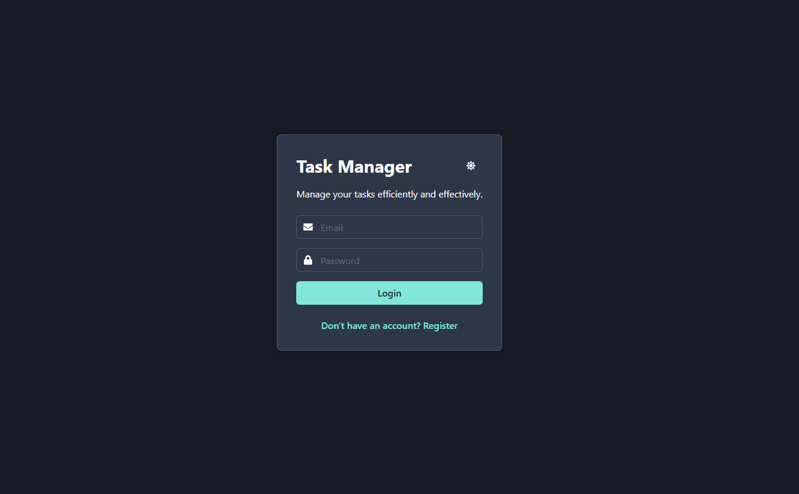
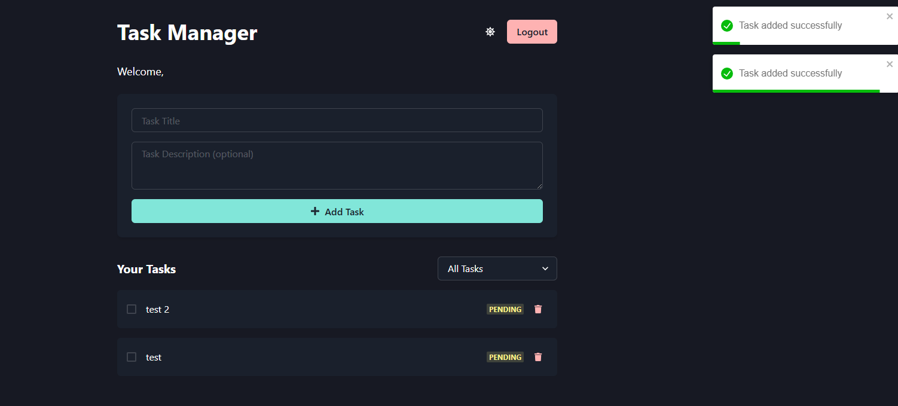
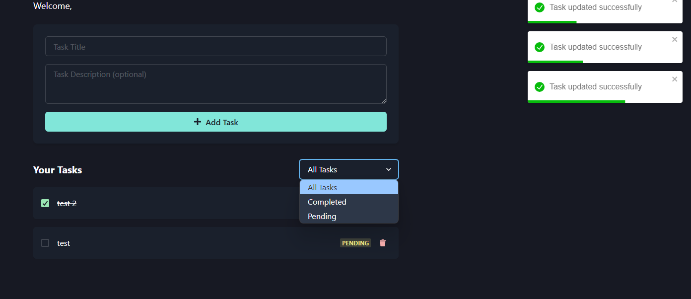
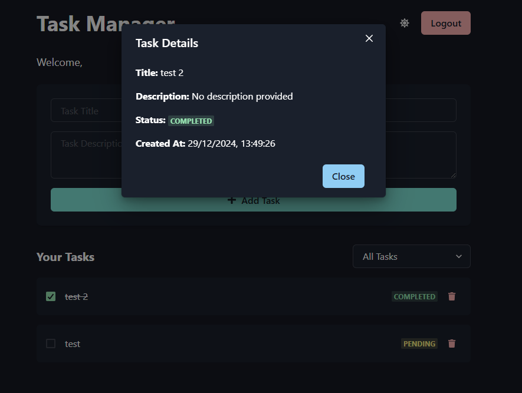

# Task Manager Frontend

Este es el frontend de la aplicación de gestión de tareas. Permite a los usuarios iniciar sesión, registrar una cuenta, agregar, editar, eliminar y filtrar tareas.







## Tecnologías Utilizadas

- **React**: Librería de JavaScript para construir interfaces de usuario.
- **Chakra UI**: Librería de componentes de React para un diseño estilizado y accesible.
- **Axios**: Cliente HTTP basado en promesas para realizar peticiones a la API.
- **React Router**: Librería para manejo de rutas en aplicaciones React.
- **React Toastify**: Librería para mostrar notificaciones.
- **Framer Motion**: Librería para animaciones en React.
- **JWT Decode**: Librería para decodificar JSON Web Tokens.

## Instalación

1. Clona el repositorio:
   ```bash
   git clone https://github.com/kaikrmen/tasks-frontend-app.git
   cd tasks-frontend-app
   ```

2. Instala las dependencias:
   ```bash
   npm install
   ```

3. Crea un archivo `.env` en la raíz del proyecto con la siguiente variable de entorno:
   ```env
   REACT_APP_API_URL=http://localhost:5000/api
   ```

4. Inicia la aplicación:
   ```bash
   npm start
   ```

## Scripts Disponibles

En el directorio del proyecto, puedes ejecutar:

### `npm start`

Inicia la aplicación en modo de desarrollo.
Abre [http://localhost:3000](http://localhost:3000) para verlo en el navegador.

### `npm test`

Inicia el corredor de pruebas en modo interactivo.
Consulta la sección sobre [running tests](https://facebook.github.io/create-react-app/docs/running-tests) para más información.

### `npm run build`

Construye la aplicación para producción en la carpeta `build`.
Agrupa adecuadamente React en modo de producción y optimiza la construcción para el mejor rendimiento.

## Componentes

### `AuthContext.js`

Gestiona la autenticación del usuario, proporcionando funciones para iniciar sesión, registrarse y cerrar sesión.

### `PrivateRoute.js`

Protege las rutas que requieren autenticación, redirigiendo a los usuarios no autenticados a la página de inicio de sesión.

### `Home.js`

Página de inicio que incluye el formulario de inicio de sesión y un botón para llevar a la página de registro.

### `Register.js`

Página de registro para crear una nueva cuenta de usuario.

### `TaskList.js`

Página principal de la aplicación donde los usuarios pueden ver, agregar, editar, eliminar y filtrar tareas.

## Pruebas

Las pruebas se realizan utilizando `Jest` y `React Testing Library`. Puedes encontrar ejemplos de pruebas en el archivo `TaskList.test.js` en la carpeta `src/pages`.

```plaintext
src/pages/TaskList.test.js
```

## Contribuir

¡Las contribuciones son bienvenidas! Si tienes alguna mejora o encuentras algún error, por favor abre un issue o envía un pull request.

## Licencia

Este proyecto está licenciado bajo la [Licencia MIT](LICENSE).
